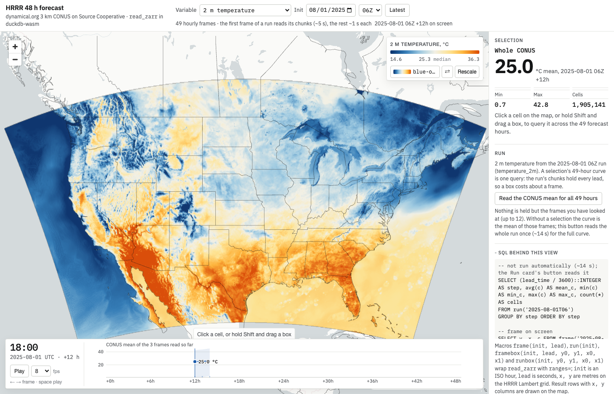

# duckdb-zarr in the browser: notes for Alex

Status 2026-09-18: upstream PRs open and ready for review, waiting on maintainers:
xqlsystems/duckdb-zarr#48 (wasm support), #49 (`ranges=` pruning plus the routes to
planner filter pushdown), #46 (kerchunk / virtual Zarr, see `HANDOFF-virtual-zarr.md`).

Live: https://duckdb-geo-zarr.netlify.app (ERA5 map: `map.html`, HRRR map:
`map-hrrr.html`, SQL consoles: `era5.html`, `hrrr.html`). Everything runs in the tab:
duckdb-wasm from jsDelivr, the `zarr` extension built for wasm, Zarr read from Source
Cooperative directly and from GCS through a Netlify rewrite. The GitHub Pages copy
(https://kentstephen.github.io/duckdb-geo-zarr/) has no proxy, so only the HRRR pages
work there.



## What was done

1. **The extension compiles and runs on `wasm32-unknown-emscripten`.** Three patches on
   top of upstream `46fd732`, in `patches/duckdb-zarr/` (apply with `git am`):
   - `0001` wasm support and `ranges=` chunk pruning. Gate `zarrs_http` off wasm and route
     every store through `DuckDbStore` (DuckDB's own HTTP filesystem does the fetching, so
     no reqwest/tokio); build rayon's global pool with one thread at extension init;
     `-fPIC` for the C dependencies (zstd-sys); `DuckDbStore::get_partial_many` loops on
     short reads because duckdb-wasm's HTTP filesystem returns 16 KiB pieces. blosc works
     as is (c-blosc with `nthreads=1` never spawns a thread).
   - `0002` `ranges=` also clips rows inside kept chunks, so the bounds are written once
     and no `WHERE` repeat is needed. Unit tests for the boundary cases `docs/design.md`
     lists (decreasing coords, non-uniform spacing, chunk-seam point, empty result,
     inclusive bounds); SQL tests check equivalence with plain `WHERE` by `EXCEPT`.
   - `0003` ISO date bounds on dimensions with CF `units`
     (`time:2020-07-01:2020-07-01T23` on ERA5, `init_time:2025-08-01T06:...` on HRRR).
   Native: unit 21/21, SQL suite 5/5, clippy and fmt clean. No new dependencies.

2. **`ranges=['dim:lo:hi', ...]` on `read_zarr`** is the substitute for planner-driven
   pushdown, which the C API blocks (`notes/predicate-pushdown-options.md` has the
   survey; `docs/design.md:45` in upstream says the same). Chunks whose coordinate
   min/max miss the range are never fetched. It is what makes remote reads practical:
   one July day over Western Europe in ARCO ERA5 touches 3 of 69,033 chunks (1.6 s in
   the browser, 2.6 s native).

3. **Browser demo on HRRR** (dynamical.org's 48 h forecast on Source Cooperative, Zarr v3
   with `sharding_indexed`, one 65 MB shard per run, inner chunks across all 49 leads).
   Sharding works on wasm unchanged. Timings from Chromium: metadata 1.1 s; first touch of a
   run 4.7 s; a 60 km box across all 49 leads 0.7 s; a full-CONUS frame (1.9M cells)
   0.85 s; all 49 leads grouped 13.7 s. Numbers agree with native.

ARCO ERA5 (`map.html`, `era5.html`) needs a same-origin proxy: `storage.googleapis.com`
sends no CORS headers for the public bucket. Locally that is `wasm/serve.py`'s `/arco/`
route; on Netlify it is a `200` rewrite in `netlify.toml` (Range and 206 pass through).
If CORS could be enabled on `gcp-public-data-arco-era5` (a `GET, HEAD` rule with `Range`
in the allowed headers and `Content-Range` exposed), the ERA5 pages would work from any
static host with no proxy.

## Things you may want to look at

- Upstream `description.yml` excludes the wasm platforms and `docs/design.md:19` says wasm
  is unsupported. The patches are the counterexample; the community extension build
  could ship `wasm_mvp` / `wasm_eh` / `wasm_threads`. Only `wasm_mvp` has been built here.
- Reading a 1-D coordinate array by `array_path` (`x`, `init_time`) fails with
  `duplicate column name` because the dimension column and the value column share the
  name. Same on native presumably.
- `ingested_forecast_length` (float64 with a fill value) reads back NULL on wasm. Not
  checked native.
- `ranges=` compares against the coordinate array's min/max per chunk, and needs a
  coordinate array per pruned dimension. Dimensions without one (or 2-D `latitude` /
  `longitude` on a projected grid) cannot be pruned; the HRRR page prunes on `x`/`y`
  in metres and projects in JS.
- If planner pushdown ever becomes possible in the C API, `ranges=` maps onto it
  directly: the same `build_work_units_pruned` and keep-mask code would take bounds from
  the filter instead of the parameter.
- PRs: the wasm changes (Cargo gating, `DuckDbStore` routing, rayon pool, short-read
  loop) are upstream as xqlsystems/duckdb-zarr#48, one commit on upstream main
  (`patches/duckdb-zarr/wasm-support-0001.patch`). `ranges=` (pruning and row clipping, no
  ISO bounds since upstream #43 adds CF time parsing) is xqlsystems/duckdb-zarr#49, whose
  body also lays out the routes to planner-driven filter pushdown
  (`patches/duckdb-zarr/ranges-pruning-0001.patch`).

## Running it yourself

```sh
git clone https://github.com/kentstephen/duckdb-geo-zarr && cd duckdb-geo-zarr
git clone https://github.com/xqlsystems/duckdb-zarr vendor/duckdb-zarr
(cd vendor/duckdb-zarr && git am ../../patches/duckdb-zarr/*.patch && make wasm_mvp)
cd wasm && npm i && npx playwright install chromium
python3 serve.py www 8765 &
node run.mjs hrrr.html                         # headless, prints the console page's log
open http://127.0.0.1:8765/map.html
```

The prebuilt `wasm/www/zarr.duckdb_extension.wasm` is committed, so the pages run without
the build step. `wasm/README.md` has the page-by-page detail and the full timing table.
